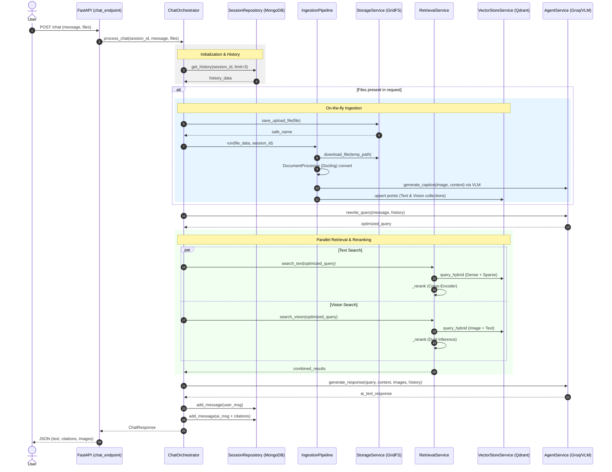
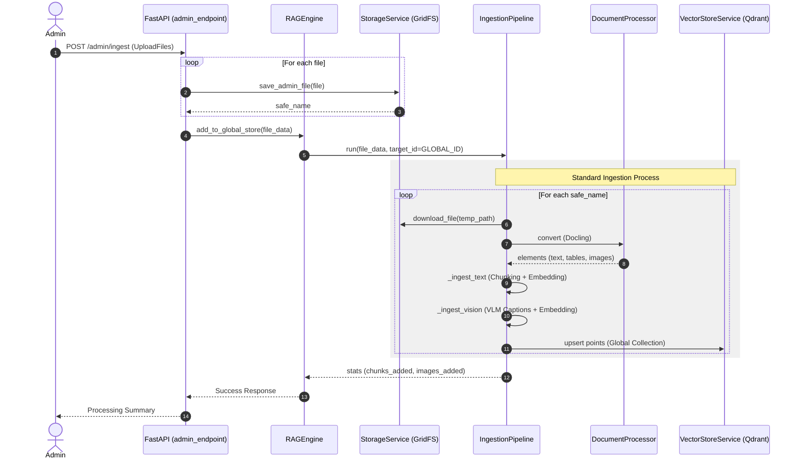
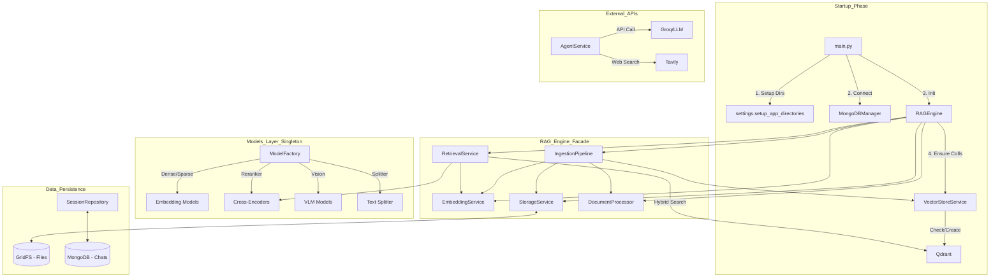

# **NEUROCORP RAG** 🤖🧠💬

### Purpose: This RAG (Retrieval-Augmented Generation) system ingests documents (PDFs, images), extracts text and visual features, indexes multimodal vectors into Qdrant, and serves hybrid semantic search + LLM responses.

### Core components: vector DB manager, embedding models, ingestion pipeline, retrieval/reranking, storage (GridFS), document processor (PDF → text+images), and agent orchestration.

# DEMO

https://github.com/user-attachments/assets/0d77280b-b7ac-4a4b-b262-06a3cfb2af4f


https://github.com/user-attachments/assets/70cd9c80-e0a2-4c17-9a06-7e5bf7c420df


https://github.com/user-attachments/assets/8047e384-3da9-4f94-93f0-7c1be37b9a25


https://github.com/user-attachments/assets/4afb197a-76cc-4a6d-80a8-114b9eb34e06


<br>

## ⚙️ TECH STACK - BACKEND

<span style="font-size:18px">

1. **AI & Machine Learning**

- Embeddings: **Sentence-Transformers** (Dense) and **FastEmbed - BM42** (Sparse) for hybrid text retrieval.
- Vision: **CLIP/SigLIP** for multimodal image-to-text search.
- Reranking: **Cross-Encoders** for high-precision result scoring.
- VLM: **Groq Vision LLM** for automated image captioning and table analysis.

2. **Data & Storage**

- Vector DB: **Qdrant** (supports Hybrid Search, RRF fusion, and multi-tenant filtering).
- Database: **MongoDB** with Motor (async driver) for session and chat history.
- File Storage: **GridFS** for storing original PDFs and extracted image crops.

3. **Document Processing (ETL)**

- Parsing: **Docling** (IBM) for structure-aware PDF extraction (headers, tables, images).
- Chunking: **LangChain** (Recursive Splitters) for semantic text segmentation.
- Image Ops: **Pillow (PIL)** for image compression and preprocessing.

4. **Backend & Orchestration**

- Framework: **FastAPI** (High-performance async **Python**).
- Orchestration: **LangChain** for LLM chain management and prompts.
- Concurrency: **Asyncio** + **ThreadPoolExecutor** for non-blocking ML inference.
- Validation: **Pydantic** for strict data schemas and settings.

</span>

<br>

## ⚙️ TECH STACK - FRONTEND

| Layer           | Technology                             |
| --------------- | -------------------------------------- |
| Framework       | Next.js 16.1 (App Router)              |
| Library         | React 19.2                             |
| Language        | TypeScript 5.x                         |
| Styling         | Tailwind CSS 4.0, PostCSS 8.x          |
| Animations      | Framer Motion 12.2                     |
| Icons           | Lucide React                           |
| Content Parsing | React Markdown (with GFM & Typography) |
| Utilities       | clsx, tailwind-merge, uuid             |
| Linting         | ESLint 9                               |

<br>

## 🏗️ Techniques & Design Patterns Applied

- **Hybrid Retrieval**: Combines **dense embeddings** (SentenceTransformers) with **sparse retrieval** (BM42 via `fastembed`). Results are merged using **Reciprocal Rank Fusion (RRF)** to balance semantic and keyword relevance.
- **Multimodal Indexing**: Documents store both **text and image vectors** in separate named vector spaces within Qdrant, allowing for cross-modal search.
- **Reranking**: A **Cross-Encoder** is applied to the top-N candidates post-retrieval to filter results and improve final precision.
- **VLM Captions**: Cloud-based **Vision-Large-Models (Groq)** generate rich image descriptions used as textual context for indexing and LLM prompting.
- **Asynchronous Orchestration**: CPU/GPU-intensive tasks (embedding, image processing, Docling extraction) are offloaded to a `ThreadPoolExecutor` via `asyncio.get_running_loop().run_in_executor` to prevent blocking the event loop.
- **Batched Operations**: Embeddings and Qdrant upserts are processed in batches to minimize network overhead and latency.
- **Concurrency Control**: Uses `asyncio.Semaphore` to limit parallel file ingestion, preventing resource exhaustion.
- **Session & Global Filtering**: Query filters merge `session_id` and global KB IDs to support both private user data and shared knowledge retrieval.
- **Fallback Web Search**: Integrates `WebSearchService` to supplement context when internal database results are insufficient.
- **Defensive Defaults**: Includes model dimension fallbacks (e.g., `text_dim=384`, `vision_dim=512`) and comprehensive `try/except` guards.

## 📊 Data Schema (Vector Payloads)

### Text Points

- `text`: The raw text chunk.
- `page_no`: Original page number.
- `original_name` / `filename`: Source document tracking.
- `related_images`: UUIDs of images found near this text.
- `session_id`: User/Session ownership.

### Vision Points

- `caption`: VLM-generated description.
- `uuid_name`: Unique image identifier.
- `original_doc` / `page_no`: Source location.
- `image` & `text` vectors: Dual vectors for multimodal search.

## ⚡ Concurrency & Performance

- **Executor Offloading**: CPU-heavy calls are moved to a `ThreadPoolExecutor` sized according to available CPU cores.
- **Batching Strategy**: `EmbeddingService` and `VectorStoreService` use a default `batch_size=64` to optimize throughput.
- **Normalization**: Embeddings are normalized server-side to ensure compatibility with **Cosine Distance** indexing.

## 🛡️ Error Handling & Robustness

- **Partial Success Logic**: Failures in image captioning or individual file ingestion log errors but allow the rest of the batch to complete.
- **Critical Failures**: `RAGEngine.initialize` raises a `RuntimeError` on DB failure to ensure the service does not start in a broken state.
- **Traceability**: All storage operations include logging and exception raising to ensure a clear audit trail of ingestion failures.

## 📄 Files & responsibilities

- **Vector DB & queries**: vector_store.py
- **Orchestration / engine**: engine.py
- **Model init factory**: factory.py
- **Embeddings wrapper**: embeddings.py
- **Ingestion pipeline**: ingestion.py
- **Retrieval + reranking**: retrieval.py
- **Document processing (PDF, VLM)**: processor.py
- **Storage (GridFS/local)**: storage.py
- **Chat orchestration**: orchestrator.py
- **Agent / LLM prompt + generation**: agent_service.py
- **Web search fallback service**: web_search.py

<br>
<br>

# 📂 Project Structure

```
neurocorp-RAG/
├─ backend/
│  ├─ app/
│  │  ├─ api/
│  │  │  ├─ admin.py
│  │  │  ├─ chat.py
│  │  │  ├─ sessions.py
│  │  │  └─ __init__.py
│  │  ├─ core/
│  │  │  ├─ config.py
│  │  │  └─ __init__.py
│  │  ├─ database/
│  │  │  ├─ qdrant_manager.py
│  │  │  ├─ session_db.py
│  │  │  └─ __init__.py
│  │  ├─ schemas/
│  │  │  ├─ admin.py
│  │  │  ├─ chat.py
│  │  │  ├─ sessions.py
│  │  │  └─ __init__.py
│  │  └─ services/
│  │     ├─ agent_service.py
│  │     ├─ orchestrator.py
│  │     ├─ rag/
│  │     │  ├─ engine.py
│  │     │  ├─ factory.py
│  │     │  ├─ ingestion.py
│  │     │  ├─ processor.py
│  │     │  ├─ retrieval.py
│  │     │  ├─ storage.py
│  │     │  ├─ vector_store.py
│  │     │  └─ __init__.py
│  │     ├─ web_search.py
│  │     └─ __init__.py
│  └─ main.py
├─ data/
├─ docker-compose.yml
├─ frontend/
│  ├─ app/
│  │  ├─ components/
│  │  │  ├─ admin/
│  │  │  │  ├─ AdminDangerZone.tsx
│  │  │  │  ├─ AdminHeader.tsx
│  │  │  │  ├─ AdminPanel.tsx
│  │  │  │  ├─ AdminStatusToast.tsx
│  │  │  │  └─ AdminUploadZone.tsx
│  │  │  ├─ chat/
│  │  │  │  ├─ ChatInterface.tsx
│  │  │  │  ├─ input/
│  │  │  │  │  ├─ ChatInput.tsx
│  │  │  │  │  └─ FilePreview.tsx
│  │  │  │  └─ message/
│  │  │  │     ├─ ai-content/
│  │  │  │     │  ├─ AiCitation.tsx
│  │  │  │     │  ├─ AiImageGallery.tsx
│  │  │  │     │  ├─ AiMarkdown.tsx
│  │  │  │     │  ├─ AiResponse.tsx
│  │  │  │     │  ├─ AiSourceFooter.tsx
│  │  │  │     │  └─ AiThinking.tsx
│  │  │  │     ├─ AttachmentList.tsx
│  │  │  │     └─ UserMessage.tsx
│  │  │  ├─ modals/
│  │  │  │  ├─ AttachmentViewerModal.tsx
│  │  │  │  ├─ DeleteSessionModal.tsx
│  │  │  │  └─ Modals.tsx
│  │  │  ├─ shared/
│  │  │  │  └─ Modal.tsx
│  │  │  └─ sidebar/
│  │  │     ├─ SessionItem.tsx
│  │  │     ├─ Sidebar.tsx
│  │  │     ├─ SidebarHeader.tsx
│  │  │     └─ SidebarNav.tsx
│  │  ├─ layout.tsx
│  │  └─ page.tsx
│  ├─ hooks/
│  │  ├─ useAdmin.ts
│  │  ├─ useChat.ts
│  │  └─ useSessions.ts
│  ├─ tailwind.config.ts
│  └─ types.ts
└─ README.md
```

<br>
<br>

# 🧩 Diagrams

### 🏷️ Main Chat & Ingestion Sequence Diagram

#### This diagram follows the lifecycle of a request from the user to the final response, including the optional ingestion of files during chat.

---



<br>

---

### 🏷️ Admin Ingestion Sequence Diagram

#### This diagram focuses on bulk processing of files to the "Global Store".

---



<br>

---

### 🏷️ System Architecture & Startup Workflow

#### This diagram illustrates the "Static" structure, the RAGEngine Facade, and how the application initializes.

---



<br>
<br>

# 🚀 How to run application? (Quickstart)

1. Qdrant, MongoDB

```sh
docker-compose up -d
```

2. Backend

```sh
cd backend

# create and activate venv (Windows):
python -m venv .venv
.venv\Scripts\activate

# install dependencies:
poetry install

# run API:
uvicorn main:app --reload
```

3. Frontend

```sh
cd frontend
npm install
npm run dev
```

(UI default: http://localhost:3000 ; API: http://localhost:8000/api/v1)
